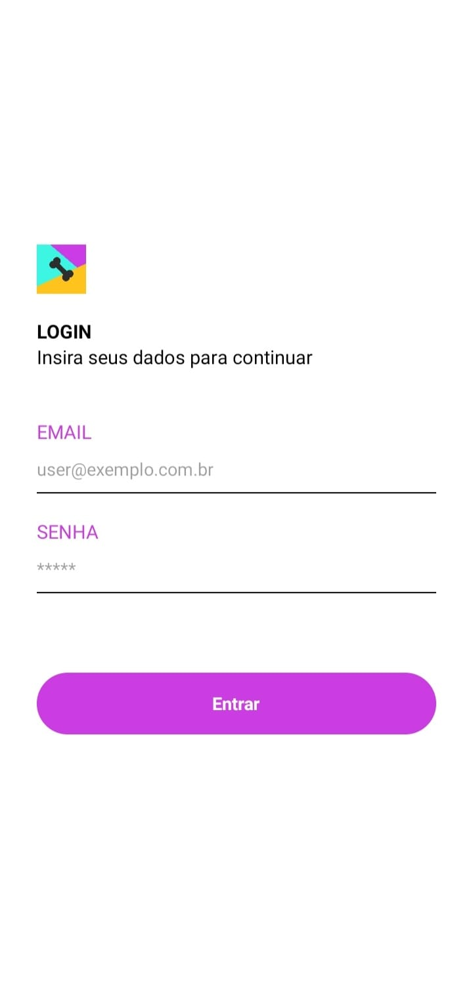
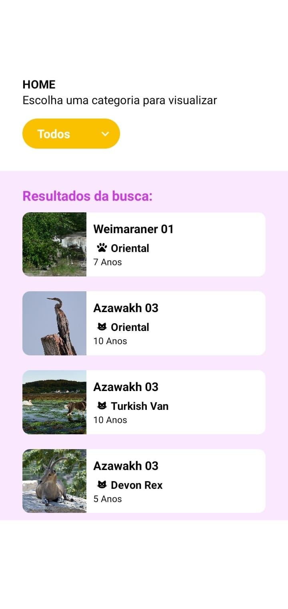
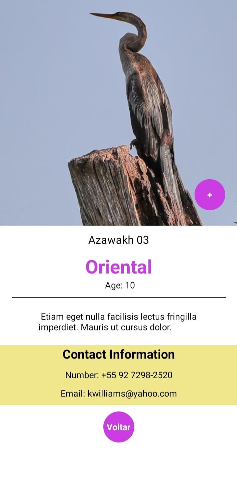

# Pet Adoption App

🇧🇷 -- Faça seu Login e visualize uma variedade de pets separados por categoria, cada um apresenta imagem, descrição, opção de contato...

🇺🇸 -- Login and visualize a variety of pets separated by category, each with an image, description, contact option...

**3 Screens Available:** 
Login > Home > Details

  
 
## Development

🇧🇷 -- Para utilizar o aplicativo você precisa instalar o aplicativo Expo Go no seu celular ou rodar através de um emulador. 
> :warning: Testado apenas em Android.

🇺🇸 -- To use this app, install the Expo Go app on your mobile or use an emulator instead.
> :warning: Tested on Android only.

- clone
- `npm install`
- `npm run start`

## Credits

🇧🇷 -- Esse app é proposto pela empresa Palmsoft e serve um propósito avaliativo.

🇺🇸 -- This app is proposed by Palmsoft company and it serves an evaluative purpose.

  
